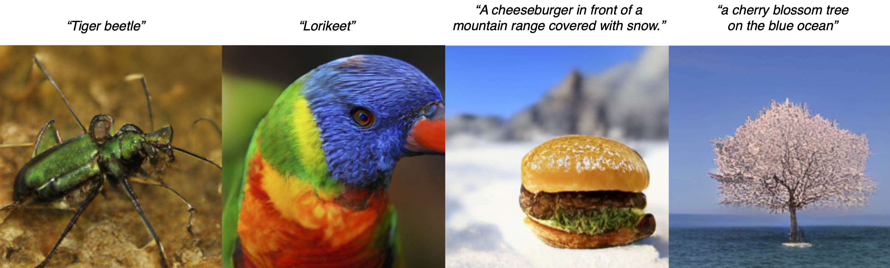
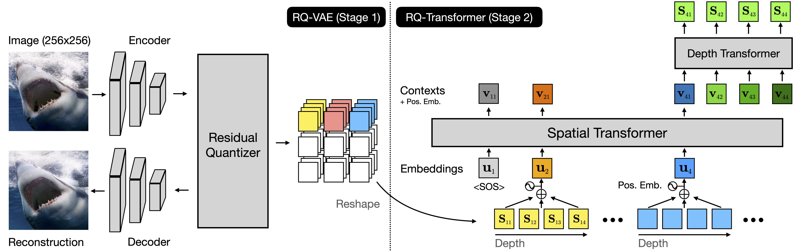

# 基于残差量化（RQ）的自回归图像生成（CVPR 2022）

这是论文 **"Autoregressive Image Generation using Residual Quantization"**（[arXiv](https://arxiv.org/abs/2203.01941)）的官方实现。

**作者**：Doyup Lee\*、Chiheon Kim\*、Saehoon Kim、Minsu Cho、Wook-Shin Han（\* 为共同一作）

**发表于 CVPR 2022**

<center></center>

上图展示了 RQ-Transformer 在类别条件和文本条件下生成的图像示例。
请注意，示例中的文本条件（text conditions）并未在训练阶段使用。

**TL;DR**：为了对高分辨率图像进行自回归（AR）建模，我们提出了一个两阶段框架，由 **RQ-VAE** 和 **RQ-Transformer** 组成。该框架能够精确逼近图像的特征图，并将图像表示为一组离散的代码，从而有效生成高质量图像。

<center></center>


## 环境依赖

我们在以下环境中测试了代码：

- `Python 3.7.10` / `PyTorch 1.9.0` / `torchvision 0.10.0` / `CUDA 11.1` / `Ubuntu 18.04`

安装依赖：

```bash
pip install -r requirements.txt
```


## 代码覆盖范围

- RQ-VAE 和 RQ-Transformer 的实现
- RQ-VAE 和 RQ-Transformer 的预训练权重
- RQ-VAE 的训练和评估流程
- RQ-Transformer 的图像生成及评估流程
- RQ-Transformer 文本到图像生成的 Jupyter Notebook


## 预训练模型

### 论文中使用的 Checkpoint

我们提供了论文中使用的 RQ-VAE 和 RQ-Transformer 预训练权重，可通过下方链接下载 `tar.gz` 文件并解压。每个链接包含对应数据集的 RQ-VAE 和 RQ-Transformer 权重及其模型配置文件。

| 数据集 | RQ-VAE & RQ-Transformer | RQ-Transformer 参数规模 | FID |
|--------|:-----------------------:|:-----------------------:|----:|
| FFHQ | [下载链接](https://twg.kakaocdn.net/brainrepo/models/RQVAE/d47570aeff6ba300735606a806f54663/ffhq.tar.gz) | 355M | 10.38 |
| LSUN-Church | [下载链接](https://twg.kakaocdn.net/brainrepo/models/RQVAE/deeb3e0ac6e09923754e3e594ede7b01/church.tar.gz) | 370M | 7.45 |
| LSUN-Cat | [下载链接](https://twg.kakaocdn.net/brainrepo/models/RQVAE/92b4e6a9ace09c9ab8ff9d3b3e688367/cat.tar.gz) | 612M | 8.64 |
| LSUN-Bedroom | [下载链接](https://twg.kakaocdn.net/brainrepo/models/RQVAE/06b72c164cd2fe64fc8ebd6b42b0040f/bedroom.tar.gz) | 612M | 3.04 |
| ImageNet (cIN) | [下载链接](https://twg.kakaocdn.net/brainrepo/models/RQVAE/7518a004fe39120fcffbba76005dc6c3/imagenet_480M.tar.gz) | 480M | 15.72 |
| ImageNet (cIN) | [下载链接](https://twg.kakaocdn.net/brainrepo/models/RQVAE/dcd39292319104da5577dec3956bfdcc/imagenet_821M.tar.gz) | 821M | 13.11 |
| ImageNet (cIN) | [下载链接](https://twg.kakaocdn.net/brainrepo/models/RQVAE/f5cf4e5f3f0b5088d52cbb5e85c1077f/imagenet_1.4B.tar.gz) | 1.4B | 11.56 (4.45) |
| ImageNet (cIN) | [下载链接](https://twg.kakaocdn.net/brainrepo/models/RQVAE/6714b47bb9382076923590eff08b1ee5/imagenet_1.4B_rqvae_50e.tar.gz) | 1.4B | 8.71 (3.89) |
| ImageNet (cIN) | [下载链接](https://twg.kakaocdn.net/brainrepo/models/RQVAE/e1ee2fef2928f7fd31f53a8348f08b88/imagenet_3.8B_rqvae_50e.tar.gz) | 3.8B | 7.55 (3.80) |
| CC-3M | [下载链接](https://twg.kakaocdn.net/brainrepo/models/RQVAE/dcd95e8f08408e113aab6451fae895f5/cc3m.tar.gz) | 654M | 12.33 |

上表中的 FID 分数基于真实样本与生成图像计算，括号内为使用预训练 ResNet-101 进行了 5% 拒绝采样（rejection sampling）后的结果。本仓库不提供拒绝采样的完整流程。


### **（注意）** 大规模文本到图像生成的 RQ-Transformer

我们还提供了用于**文本到图像（T2I）生成**的大规模 RQ-Transformer 预训练权重。论文提交后，我们在约 **3000万对** 来自 [CC-3M](https://github.com/google-research-datasets/conceptual-captions)、[CC-12M](https://github.com/google-research-datasets/conceptual-12m) 和 [YFCC-subset](https://github.com/openai/CLIP/blob/main/data/yfcc100m.md) 的图文对数据上训练了 **39亿参数** 的 RQ-Transformer，但该部分结果未包含在原论文中。请使用下方链接下载该 T2I 模型的权重。我们郑重声明：**禁止将预训练权重用于任何商业目的**。

#### 下载 3000万图文对上预训练的 RQ-Transformer

| 数据集 | RQ-VAE & RQ-Transformer | 参数规模 |
|------------------------------|:-----------------------:|:--------:|
| CC-3M + CC-12M + YFCC-subset | [下载链接](https://twg.kakaocdn.net/brainrepo/models/RQVAE/3a8429cd7ec0e0f2b66fca94804c79d5/cc3m_cc12m_yfcc.tar.gz) | 3.9B |

#### 大规模 RQ-Transformer 在 MS-COCO 上的评估

我们使用 3.9B 参数的 RQ-Transformer 在 MS-COCO 上进行了评估。遵循 [DALL-Eval](https://arxiv.org/abs/2202.04053) 的评估协议，我们从 MS-COCO 的 `val2014` 划分中随机选取了 3万条文本描述，生成 256x256 图像，并使用 (1024, 0.95) 的 top-(k, p) 采样策略。其他模型的 FID 分数来源于 [DALL-Eval](https://arxiv.org/abs/2202.04053) 论文的 Table 2。

| 模型 | 参数规模 | 训练数据量 | 图像 / Grid 大小 | MS-COCO 2014 val FID |
|-----------------------|:--------:|:------:|:-----------------:|:----------------------------:|
| X-LXMERT | 228M | 180K | 256x256 / 8x8 | 37.4 |
| DALL-E small | 120M | 15M | 256x256 / 16x16 | 45.8 |
| ruDALL-E-XL | 1.3B | 120M | 256x256 / 32x32 | 18.6 |
| minDALL-E | 1.3B | 15M | 256x256 / 16x16 | 24.6 |
| RQ-Transformer（ ours） | 3.9B | 30M | 256x256 / 8x8x4 | **16.9** |

请注意，MS-COCO 中的部分文本描述也被包含在 YFCC-subset 中，但在评估时是否去除重复文本描述，FID 分数差异不大，详见[该论文](https://arxiv.org/abs/2102.12092)。

#### 使用 RQ-Transformer 进行文本到图像（T2I）生成示例

我们提供了一个 Jupyter Notebook，方便你直接使用预训练的 RQ-Transformer 进行文本到图像生成。下载预训练的 T2I checkpoint 后，打开 `notebooks/T2I_sampling.ipynb` 并按照 Notebook 中的说明操作。由于模型规模较大，建议使用 NVIDIA V100 或 A100 等显存超过 32GB 的 GPU。

以下是我们提供的 Jupyter Notebook 中的一些 T2I 生成示例：

**文本条件生成的图像示例**

<details>
<summary>a painting by Vincent Van Gogh</summary>
<center></center>
</details>

<details>
<summary>a painting by RENÉ MAGRITTE</summary>
<center></center>
</details>

<details>
<summary>Eiffel tower on a desert.</summary>
<center></center>
</details>

<details>
<summary>Eiffel tower on a mountain.</summary>
<center></center>
</details>

<details>
<summary>a painting of a cat with sunglasses in the frame.</summary>
<center></center>
</details>

<details>
<summary>a painting of a dog with sunglasses in the frame.</summary>
<center></center>
</details>


## RQ-VAE 的训练与评估

### RQ-VAE 训练

我们的实现使用 PyTorch 的 `DistributedDataParallel` 进行多节点、多 GPU 的高效训练。论文中所有 RQ-VAE 均在 **四张 NVIDIA A100 GPU** 上训练。你也可以根据自身 GPU 环境调整 `-nr`、`-np`、`-nr` 等参数。

- 在单节点四卡上训练 ImageNet 256x256 的 8x8x4 RQ-VAE：
    ```bash
    python -m torch.distributed.launch \
        --master_addr=$MASTER_ADDR \
        --master_port=$PORT \
        --nnodes=1 --nproc_per_node=4 --node_rank=0 \
        main_stage1.py \
        -m=configs/imagenet256/stage1/in256-rqvae-8x8x4.yaml -r=$SAVE_DIR
    ```

- 如果想在四节点、每节点单卡的环境下训练，请在每个节点上运行（`$RANK` 为节点编号 0、1、2、3），假设主节点 rank 为 0：
    ```bash
    python -m torch.distributed.launch \
        --master_addr=$MASTER_ADDR \
        --master_port=$PORT \
        --nnodes=4 --nproc_per_node=1 --node_rank=$RANK \
        main_stage1.py \
        -m=configs/imagenet256/stage1/in256-rqvae-8x8x4.yaml -r=$SAVE_DIR
    ```

### 预训练 RQ-VAE 的微调

- 若要将预训练的 RQ-VAE 在其他数据集（如 LSUN 系列）上进行微调，需要通过 `-l=$RQVAE_CKPT` 参数加载预训练权重。
- 以在 LSUN-Church 上微调为例：
    ```bash
    python -m torch.distributed.launch \
        --master_addr=$MASTER_ADDR \
        --master_port=$PORT \
        --nnodes=1 --nproc_per_node=4 --node_rank=0 \
        main_stage1.py \
        -m=configs/lsun-church/stage1/church256-rqvae-8x8x4.yaml -r=$SAVE_DIR -l=$RQVAE_CKPT
    ```

### RQ-VAE 评估

运行 `compute_rfid.py` 评估所训练 RQ-VAE 的重构 FID（rFID）：

```bash
python compute_rfid.py --split=val --vqvae=$RQVAE_CKPT
```

- RQ-VAE 的模型权重和对应的 yaml 配置文件需放在同一目录下。
- `compute_rfid.py` 会根据配置文件中指定的数据集评估 rFID。
- 请根据 GPU 显存大小调整 `--batch-size` 参数。


## RQ-Transformer 的评估

本仓库中的代码可以复现论文中的量化结果。在评估 RQ-Transformer 之前，需要准备好数据集以计算样本的特征向量。为了避免重复提取特征向量带来的高昂计算成本，我们直接提供了各数据集的特征向量统计信息。你也可以按照 `data/READMD.md` 中的说明自行准备数据集。

- 下载数据集特征向量统计信息：
    ```bash
    cd assets
    wget https://twg.kakaocdn.net/brainrepo/etc/RQVAE/8b325b628f49bf60a3094fcf9419398c/fid_stats.tar.gz
    tar -zxvf fid_stats.tar.gz
    ```

#### FFHQ、LSUN-{Church, Bedroom, Cat}、ImageNet（类别条件）

- 预训练的 RQ-Transformer 生成 5万张图像后，计算生成图像与训练样本之间的 FID（和 IS）。
- 可通过 `--save-dir` 指定生成图像的保存目录；若不指定，则保存在 checkpoint 目录下。
- 单节点四卡运行方式：
    ```bash
    python -m torch.distributed.launch \
      --master_addr=$MASTER_ADDR \
      --master_port=$PORT \
      --nnodes=1 --nproc_per_node=4 --node_rank=0 \
      main_sampling_fid.py \
      -v=$RQVAE_CKPT -a=$RQTRANSFORMER_CKPT --save-dir=$SAVE_IMG_DIR
    ```

#### CC-3M

- 使用 CC-3M 验证集的文本描述生成图像，计算验证图像与生成图像之间的 FID，同时计算生成图像与文本描述的 CLIP score。
- RQ-Transformer 的评估需要 CC-3M 的文本描述，请先参考 [`data/READMD.md`](data/READMD.md) 准备数据集。
- 单节点四卡运行方式：
    ```bash
    python -m torch.distributed.launch \
      --master_addr=$MASTER_ADDR \
      --master_port=$PORT \
      --nnodes=1 --nproc_per_node=4 --node_rank=0 \
      main_sampling_txt2img.py \
      -v=$RQVAE_CKPT -a=$RQTRANSFORMER_CKPT --dataset="cc3m" --save-dir=$SAVE_IMG_DIR
    ```

#### MS-COCO

- 我们遵循 DALL-Eval 的协议，从 MS-COCO `2014val` 划分中随机选取 3万条文本描述，并将采样结果以 JSON 文件形式提供。
- 评估需要 MS-COCO 的文本描述，请先参考 [`data/READMD.md`](data/READMD.md) 准备数据集。
- 单节点四卡运行方式：
    ```bash
    python -m torch.distributed.launch \
      --master_addr=$MASTER_ADDR \
      --master_port=$PORT \
      --nnodes=1 --nproc_per_node=4 --node_rank=0 \
      main_sampling_txt2img.py \
      -v=$RQVAE_CKPT -a=$RQTRANSFORMER_CKPT --dataset="coco_2014val" --save-dir=$SAVE_IMG_DIR
    ```

**注意事项**

- 很遗憾，我们没有提供 RQ-Transformer 的训练代码，以避免因微调我们的预训练权重而产生的潜在滥用风险。我们郑重声明：**禁止将预训练权重用于任何商业目的**。
- 为准确复现论文结果，**RQ-VAE 和 RQ-Transformer 的 checkpoint 必须按上述说明正确匹配**。
- 生成图像以 `.pkl` 文件形式保存在 `$DIR_SAVED_IMG` 目录下。
- top-k 和 top-p 采样策略使用预训练 checkpoint 配置文件中保存的设置。如需更改，可使用 `--top-k` 和 `--top-p` 参数。
- 生成图像后，可使用 `compute_metrics.py` 重新评估：
    ```bash
    python compute_metrics.py fake_path=$DIR_SAVED_IMG ref_dataset=$DATASET_NAME
    ```

### 采样速度基准测试

我们提供了测量 RQ-Transformer 在不同 RQ-VAE code shape（如 8x8x4 或 16x16x1）下采样速度的代码，对应论文中的 Figure 4。在 NVIDIA A100 GPU 上运行以下命令复现该图：

```bash
# RQ-Transformer (1.4B) on 16x16x1 RQ-VAE（对应 VQ-GAN 1.4B 模型）
python -m measure_throughput f=16 d=1 c=16384 model=huge batch_size=100
python -m measure_throughput f=16 d=1 c=16384 model=huge batch_size=200
python -m measure_throughput f=16 d=1 c=16384 model=huge batch_size=500  # 会导致 OOM

# RQ-Transformer (1.4B) on 8x8x4 RQ-VAE
python -m measure_throughput f=32 d=4 c=16384 model=huge batch_size=100
python -m measure_throughput f=32 d=4 c=16384 model=huge batch_size=200
python -m measure_throughput f=32 d=4 c=16384 model=huge batch_size=500
```


## 引用

```bibtex
@inproceedings{lee2022autoregressive,
  title={Autoregressive Image Generation using Residual Quantization},
  author={Lee, Doyup and Kim, Chiheon and Kim, Saehoon and Cho, Minsu and Han, Wook-Shin},
  booktitle={Proceedings of the IEEE/CVF Conference on Computer Vision and Pattern Recognition},
  pages={11523--11532},
  year={2022}
}
```


## 许可证

- 源代码基于 [Apache 2.0](LICENSE.apache-2.0) 许可证开源。
- 预训练权重基于 [CC-BY-NC-SA 4.0](LICENSE.cc-by-nc-sa-4.0) 许可证授权，**禁止商业使用**。


## 联系方式

如需合作或提供反馈，请联系我们：contact@kakaobrain.com


## 致谢

本项目中 Transformer 相关的实现参考了 [minGPT](https://github.com/karpathy/minGPT) 和 [minDALL-E](https://github.com/kakaobrain/minDALL-E)。感谢 [VQGAN](https://github.com/CompVis/taming-transformers) 作者开源了他们的代码。


## 局限性

由于 RQ-Transformer 训练于公开数据集，根据文本条件生成的图像中可能包含一些社会不可接受的内容。如遇到此类问题，请将"文本条件"与"生成图像"一并告知我们。
